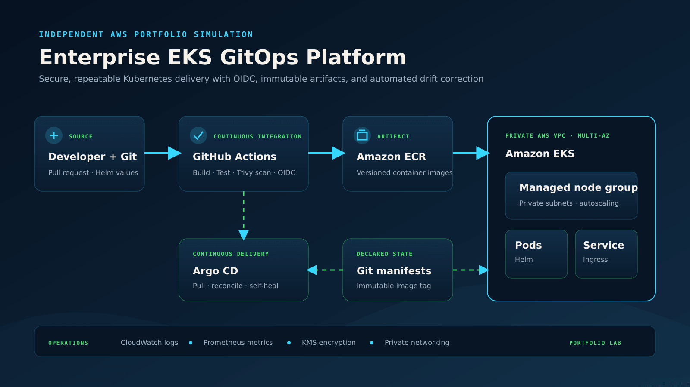

# Enterprise EKS GitOps Platform

Portfolio project demonstrating a reusable AWS EKS platform for regulated, multi-environment workloads. It mirrors the engineering patterns used in enterprise insurance and fintech—without using employer code, data, or infrastructure.



## What this demonstrates

- Terraform-managed VPC and private Amazon EKS cluster
- Managed node groups, encryption, control-plane logging, and least-privilege access
- GitHub Actions authentication to AWS through OIDC (no long-lived AWS keys)
- Argo CD pull-based deployment with automated drift correction
- Helm-based application packaging and environment-specific values
- Safe defaults: private nodes, encrypted secrets, audit logs, and immutable image tags

The diagram shows the intended lab architecture. It is design evidence, not proof of a currently running AWS environment.

## Repository layout

```text
terraform/       AWS VPC, EKS, IAM, and logging
helm/platform/   Example workload chart
argocd/          Declarative Argo CD Application
.github/         Validation and security workflow
docs/            Architecture and interview guide
```

## Quick start

1. Install Terraform, AWS CLI, kubectl, Helm, and an AWS account with sufficient sandbox permissions.
2. Copy `terraform/terraform.tfvars.example` to `terraform/terraform.tfvars` and update values.
3. Run `terraform init`, `terraform plan`, and `terraform apply` from `terraform/`.
4. Configure kubectl with `aws eks update-kubeconfig --name <cluster-name>`.
5. Install Argo CD, replace the repository URL in `argocd/application.yaml`, and apply it.

> Cost warning: EKS, NAT gateways, and worker nodes incur AWS charges. Destroy the lab when finished with `terraform destroy`.

## Production decisions

| Decision | Why |
|---|---|
| Private worker subnets | Reduces direct internet exposure |
| KMS secrets encryption | Adds control over Kubernetes secret encryption |
| OIDC federation | Avoids long-lived cloud credentials in CI |
| GitOps pull model | Keeps cluster credentials out of the build pipeline |
| Automated prune/self-heal | Corrects configuration drift from declared Git state |

## Interview talking points

- Explain why CI builds an artifact while Argo CD performs deployment.
- Describe how you would separate dev, QA, and production accounts.
- Discuss rollout gates, Argo CD sync windows, PodDisruptionBudgets, and rollback.
- Explain how control-plane logs, metrics, and distributed tracing support incident response.

## References

- [Amazon EKS documentation](https://docs.aws.amazon.com/eks/latest/userguide/what-is-eks.html)
- [Argo CD automated sync](https://argo-cd.readthedocs.io/en/stable/user-guide/auto_sync/)
- [GitHub Actions OIDC with AWS](https://docs.github.com/actions/deployment/security-hardening-your-deployments/configuring-openid-connect-in-amazon-web-services)

## Disclaimer

Independent educational portfolio project. It is not affiliated with, endorsed by, or deployed at any current or former employer.
